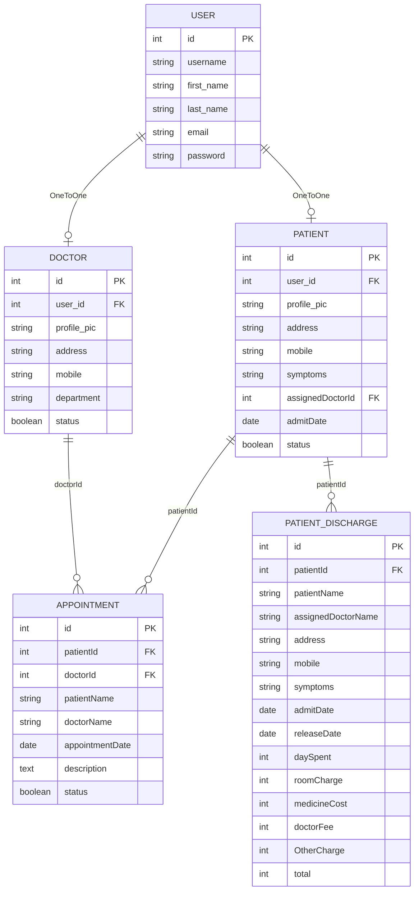

# 🏥 Hospital Management System | Hệ thống Quản lý Bệnh viện

<!-- markdownlint-disable MD033 -->
<p align="center">
  
  
  
  
  
</p>

<p align="center">
  
</p>
<!-- markdownlint-enable MD033 -->

---

**English** | [**Tiếng Việt**](#tiếng-việt)

---

## English Version

A comprehensive **Hospital Management System** built with Django 3.0.5, Bootstrap 5.3, and SQLite. This system provides role-based access control for Administrators, Doctors, and Patients with complete CRUD operations, appointment management, and PDF bill generation.

### Key Features

- **Multi-role Authentication** — Separate login portals for Admin, Doctor, and Patient
- **Appointment Management** — Book, approve, view, and delete appointments
- **Patient Management** — Admit, discharge, and manage patient records
- **Doctor Management** — Add, approve, update, and remove doctors
- **PDF Bill Generation** — Generate downloadable discharge bills with xhtml2pdf
- **Responsive Design** — Mobile-friendly UI with Bootstrap 5.3
- **6 Medical Departments** — Cardiologist, Dermatologists, Emergency Medicine, etc.

### Live Demo

> ⚠️ **Note**: This is a demo project. No live demo URL is currently hosted.

### Quick Links

[](https://example.com)
[](#-getting-started--bắt-đầu-nhanh)
[](https://github.com/example/hospital-management/issues)
[](https://github.com/example/hospital-management/issues)

---

## ✨ Features | Tính năng

### Role-Based Access Comparison | So sánh quyền truy cập theo vai trò

| Feature / Tính năng | Admin | Doctor | Patient |
|---------------------|:-----:|:------:|:-------:|
| **Dashboard** | ✅ | ✅ | ✅ |
| **Login/Logout** | ✅ | ✅ | ✅ |
| **Register (Signup)** | ✅ (Auto-approved) | ✅ (Need approval) | ✅ (Need approval) |
| **View All Doctors** | ✅ | ✅ | ✅ |
| **Add Doctor** | ✅ | ❌ | ❌ |
| **Update Doctor** | ✅ | ❌ | ❌ |
| **Delete Doctor** | ✅ | ❌ | ❌ |
| **Approve Doctor** | ✅ | ❌ | ❌ |
| **View All Patients** | ✅ | ✅ (Assigned only) | ❌ |
| **Add Patient** | ✅ | ❌ | ❌ |
| **Update Patient** | ✅ | ❌ | ❌ |
| **Delete Patient** | ✅ | ❌ | ❌ |
| **Approve Patient** | ✅ | ❌ | ❌ |
| **Discharge Patient** | ✅ | ❌ | ❌ |
| **Generate PDF Bill** | ✅ | ❌ | ❌ |
| **Download PDF Bill** | ✅ | ❌ | ✅ (Own only) |
| **View Appointments** | ✅ All | ✅ Own | ✅ Own |
| **Book Appointment** | ✅ | ❌ | ✅ |
| **Approve Appointment** | ✅ | ❌ | ❌ |
| **Delete Appointment** | ❌ | ✅ (Own) | ❌ |
| **Search** | ❌ | ✅ | ✅ |
| **View Department** | ✅ | ✅ | ✅ |
| **Contact Us** | ✅ | ✅ | ✅ |

### Detailed Features by Role | Chi tiết tính năng theo vai trò

#### 👨‍💼 Administrator (Quản trị viên)

- **Authentication** — Register and login without approval required
- **Doctor Management**
  - Add new doctors with department assignment
  - View all approved doctors
  - Update doctor information
  - Delete doctors from system
  - Approve/reject doctor registration requests
  - View doctors by specialization
- **Patient Management**
  - Admit new patients and assign to doctors
  - View all admitted patients
  - Update patient information
  - Delete patients from system
  - Approve/reject patient registration requests
- **Appointment Management**
  - Create appointments between doctors and patients
  - View all appointments
  - Approve/reject patient appointment requests
- **Discharge & Billing**
  - Discharge patients with complete bill calculation
  - Generate PDF bills (room charge, medicine cost, doctor fee, other charges)
  - Download PDF bills for records
- **Dashboard Statistics**
  - Total approved doctors count
  - Pending doctor approvals count
  - Total admitted patients count
  - Pending patient approvals count
  - Total appointments count
  - Pending appointment approvals count

#### 👨‍⚕️ Doctor (Bác sĩ)

- **Authentication** — Register (requires admin approval), login
- **Patient Management**
  - View assigned patients (symptoms, contact info, admit date)
  - Search patients by name or symptoms
  - View discharged patients
- **Appointment Management**
  - View appointments assigned by admin
  - Delete appointments after attending
- **Dashboard**
  - Patient count (assigned)
  - Appointment count
  - Discharged patient count

#### 🤒 Patient (Bệnh nhân)

- **Authentication** — Register (requires admin approval), login
- **Doctor Information**
  - View assigned doctor details (name, department, mobile, address)
  - Search and view all available doctors
- **Appointment Management**
  - Book new appointments with doctors
  - View own appointment status (pending/approved)
- **Discharge & Billing**
  - View discharge summary
  - Download PDF bill after discharge
- **Dashboard**
  - Personal information display
  - Assigned doctor information
  - Admit date and symptoms

---

## 🖼️ Screenshots | Ảnh chụp màn hình

> 📌 **Note**: Screenshots coming soon. This is a placeholder section.

| Landing Page | Admin Dashboard |
|--------------|-----------------|
|  |  |

| Doctor Dashboard | Patient Dashboard |
|------------------|-------------------|
|  |  |

| PDF Bill Sample |
|-----------------|
|  |

---

## 🏗️ Project Structure | Cấu trúc thư mục

```
hospital-management/
├── hospital/                      # Main Django application
│   ├── __pycache__/                # Python cache files
│   ├── migrations/                 # Database migrations (18 files)
│   │   ├── 0001_initial.py          # Initial migration
│   │   ├── 0002_delete_teacherextra.py
│   │   ├── 0003_patient_admitdate.py
│   │   ├── ...
│   │   └── 0018_auto_20201015_2036.py
│   ├── __init__.py
│   ├── admin.py                   # Django admin configuration
│   ├── apps.py                    # App configuration
│   ├── forms.py                   # Django forms (Admin, Doctor, Patient, Appointment)
│   ├── models.py                  # Database models (Doctor, Patient, Appointment, PatientDischargeDetails)
│   ├── views.py                   # Business logic (~850 lines, 32KB)
│   └── urls.py                    # App URL patterns (included in main urls.py)
│
├── hospitalmanagement/             # Django project settings
│   ├── __init__.py
│   ├── asgi.py                    # ASGI configuration
│   ├── settings.py                # Project settings (DEBUG, DATABASES, INSTALLED_APPS, etc.)
│   ├── urls.py                    # Main URL routing
│   └── wsgi.py                    # WSGI configuration
│
├── templates/hospital/            # 58 HTML templates
│   ├── index.html                 # Landing page
│   ├── aboutus.html               # About page
│   ├── contactus.html             # Contact form
│   ├── contactussuccess.html      # Contact success message
│   ├── navbar.html                # Shared navigation
│   ├── footer.html                # Shared footer
│   ├── homebase.html              # Base template for public pages
│   │
│   ├── adminclick.html            # Admin role selection
│   ├── adminlogin.html            # Admin login
│   ├── adminsignup.html           # Admin registration
│   ├── admin_base.html            # Admin dashboard base
│   ├── admin_dashboard.html       # Admin dashboard
│   ├── admin_dashboard_cards.html # Admin dashboard stats cards
│   ├── admin_doctor.html          # Doctor management menu
│   ├── admin_view_doctor.html     # View doctors list
│   ├── admin_add_doctor.html      # Add new doctor
│   ├── admin_update_doctor.html   # Update doctor info
│   ├── admin_approve_doctor.html  # Approve doctor requests
│   ├── admin_view_doctor_Specialisation.html # View by department
│   ├── admin_patient.html         # Patient management menu
│   ├── admin_view_patient.html    # View patients list
│   ├── admin_add_patient.html     # Add new patient
│   ├── admin_update_patient.html  # Update patient info
│   ├── admin_approve_patient.html # Approve patient requests
│   ├── admin_discharge_patient.html # Discharge patient
│   ├── patient_generate_bill.html # Generate bill form
│   ├── patient_final_bill.html    # Bill preview
│   ├── download_bill.html         # PDF template
│   ├── admin_appointment.html     # Appointment management menu
│   ├── admin_view_appointment.html # View appointments
│   ├── admin_add_appointment.html # Create appointment
│   ├── admin_approve_appointment.html # Approve appointments
│   │
│   ├── doctorclick.html           # Doctor role selection
│   ├── doctorlogin.html           # Doctor login
│   ├── doctorsignup.html          # Doctor registration
│   ├── doctor_base.html           # Doctor dashboard base
│   ├── doctor_dashboard.html      # Doctor dashboard
│   ├── doctor_dashboard_cards.html # Doctor dashboard stats
│   ├── doctor_patient.html        # Patient management menu
│   ├── doctor_view_patient.html   # View assigned patients
│   ├── doctor_view_discharge_patient.html # View discharged patients
│   ├── doctor_appointment.html    # Appointment menu
│   ├── doctor_view_appointment.html # View appointments
│   ├── doctor_delete_appointment.html # Delete appointment
│   ├── doctor_wait_for_approval.html # Pending approval page
│   │
│   ├── patientclick.html          # Patient role selection
│   ├── patientlogin.html          # Patient login
│   ├── patientsignup.html         # Patient registration
│   ├── patient_base.html          # Patient dashboard base
│   ├── patient_dashboard.html     # Patient dashboard
│   ├── patient_dashboard_cards.html # Patient dashboard stats
│   ├── patient_appointment.html   # Appointment menu
│   ├── patient_book_appointment.html # Book appointment form
│   ├── patient_view_appointment.html # View appointments
│   ├── patient_view_doctor.html   # View doctors
│   ├── patient_discharge.html     # Discharge summary
│   ├── patient_wait_for_approval.html # Pending approval page
│   └── admin_doctor_patient_card.html # Reusable card component
│
├── static/                        # Static files
│   ├── style.css                  # Custom CSS design system (700+ lines)
│   └── images/                    # Static images
│       ├── admin.png
│       ├── adminpropic.png
│       ├── bg.jpg
│       ├── doctor.png
│       └── patient.jpg
│
├── .gitignore                     # Git ignore rules
├── LICENSE                        # MIT License
├── manage.py                      # Django management script
├── REDESIGN_SUMMARY.md            # Redesign notes
├── requirement.txt                # Python dependencies
└── README.md                      # This file
```

---

## 🛠️ Tech Stack | Công nghệ sử dụng

| Technology | Version | Purpose |
|------------|---------|---------|
| **Django** | 3.0.5 | Full-stack Python web framework |
| **Python** | 3.7+ | Server-side programming language |
| **Bootstrap** | 5.3.0 | Responsive CSS framework |
| **Font Awesome** | 6.4.0 | Icon library |
| **Inter** | Latest | Google Fonts typography |
| **xhtml2pdf** | Latest | PDF generation library |
| **django-widget-tweaks** | 1.4.8 | Django form rendering |
| **sqlparse** | 0.3.1 | SQL parsing utilities |
| **SQLite** | Built-in | Default database (development) |
| **CSS Custom Properties** | Modern | Design system tokens |

---

## ⚡ Getting Started | Bắt đầu nhanh

### 7.1 Prerequisites | Yêu cầu hệ thống

Before installing, make sure you have:

- **Python 3.7 or higher** — [Download Python](https://www.python.org/downloads/)

  ```bash
  # Verify Python installation
  python --version
  # Expected: Python 3.7.x, 3.8.x, 3.9.x, 3.10.x, 3.11.x, or 3.12.x
  ```

- **pip** — Comes with Python (verify with `pip --version`)

- **Git** — [Download Git](https://git-scm.com/downloads)

- **Modern Web Browser** — Chrome, Firefox, Safari, or Edge

### 7.2 Installation | Cài đặt

#### Step 1: Clone the Repository | Sao chép repository

```bash
# Clone the project
git clone https://github.com/YOUR_USERNAME/hospital-management.git

# Navigate to project directory
cd hospital-management
```

#### Step 2: Create Virtual Environment | Tạo môi trường ảo

> 💡 **Why use virtual environment?**
> Virtual environments isolate project dependencies, preventing conflicts between different projects. Each project can have its own versions of packages without affecting system-wide Python or other projects.

```bash
# Windows
python -m venv venv
venv\Scripts\activate

# macOS / Linux
python3 -m venv venv
source venv/bin/activate
```

#### Step 3: Install Dependencies | Cài đặt các gói phụ thuộc

```bash
# Install from requirements.txt
pip install -r requirement.txt

# Or install individually
pip install Django==3.0.5
pip install django-widget-tweaks==1.4.8
pip install xhtml2pdf
pip install sqlparse==0.3.1
```

#### Step 4: Database Setup | Thiết lập cơ sở dữ liệu

```bash
# Create database migrations
python manage.py makemigrations

# Apply migrations to database
python manage.py migrate
```

> 📌 **Note**: This will create `db.sqlite3` file in the project root.

#### Step 5: Create Superuser (Optional) | Tạo superuser (Tùy chọn)

```bash
# Create Django admin superuser
python manage.py createsuperuser

# Follow prompts:
# Username: admin
# Email address: admin@example.com
# Password: ********
# Password (again): ********
```

#### Step 6: Run Development Server | Chạy server phát triển

```bash
# Start the server
python manage.py runserver
```

#### Step 7: Access the Application | Truy cập ứng dụng

Open your browser and navigate to:

```
http://127.0.0.1:8000/
```

### 7.3 Email Configuration | Cấu hình Email (Contact Us)

To enable the Contact Us email feature, you need to configure SMTP settings.

> ⚠️ **Important**: Google has disabled "Less Secure Apps". You MUST use **App Password** instead.

#### Step-by-step: Create Google App Password

1. **Enable 2-Factor Authentication** on your Google account
   - Go to: <https://myaccount.google.com/signinoptions/two-step-verification>

2. **Generate App Password**
   - Go to: <https://myaccount.google.com/apppasswords>
   - Select App: **Mail**
   - Select Device: **Other (Custom name)** → Enter "Hospital Management"
   - Click **Generate**

3. **Copy the 16-character password** (format: `xxxx xxxx xxxx xxxx`)

#### Update settings.py

```python
# hospitalmanagement/settings.py

# Find and update these settings:

EMAIL_HOST = 'smtp.gmail.com'
EMAIL_PORT = 587
EMAIL_USE_TLS = True
EMAIL_HOST_USER = 'your-email@gmail.com'
EMAIL_HOST_PASSWORD = 'xxxx xxxx xxxx xxxx'  # Your 16-char App Password
EMAIL_RECEIVING_USER = 'your-email@gmail.com'

# Optional: Set a default from email
DEFAULT_FROM_EMAIL = 'Hospital Management <your-email@gmail.com>'
```

> 💡 **Alternative Email Providers**: You can also use Outlook, Yahoo, or custom SMTP servers by changing the `EMAIL_HOST` and related settings.

---

## 🔐 Role-Based Access | Phân quyền theo vai trò

### User Flow Diagram | Lưu đồ người dùng

```
┌─────────────────────────────────────────────────────────────────────────────┐
│                           ADMIN WORKFLOW                                    │
├─────────────────────────────────────────────────────────────────────────────┤
│                                                                             │
│   ┌──────────┐    ┌─────────────┐    ┌──────────────┐                    │
│   │ Register │───▶│  Login      │───▶│  Dashboard   │                    │
│   │ (Auto)   │    │ (No Approval)│    │  (Full Access)│                   │
│   └──────────┘    └─────────────┘    └──────────────┘                    │
│                                                 │                           │
│                                                 ▼                           │
│                                      ┌──────────────────┐                   │
│                                      │ • Manage Doctors │                   │
│                                      │ • Manage Patients│                   │
│                                      │ • Manage Appointments              │
│                                      │ • Discharge & Bills│                │
│                                      └──────────────────┘                   │
└─────────────────────────────────────────────────────────────────────────────┘

┌─────────────────────────────────────────────────────────────────────────────┐
│                           DOCTOR WORKFLOW                                   │
├─────────────────────────────────────────────────────────────────────────────┤
│                                                                             │
│   ┌──────────┐    ┌─────────────┐    ┌──────────────┐    ┌────────────┐ │
│   │ Register │───▶│ Wait for    │───▶│   Login      │───▶│  Dashboard │ │
│   │          │    │  Approval   │    │ (Approved)   │    │            │ │
│   └──────────┘    └─────────────┘    └──────────────┘    └────────────┘ │
│                                                                   │        │
│                                                                   ▼        │
│                                                        ┌──────────────────┐ │
│                                                        │ • View Patients │ │
│                                                        │ • View Appointments              │
│                                                        │ • Delete Appointments            │
│                                                        │ • Search Patients│              │
│                                                        └──────────────────┘ │
└─────────────────────────────────────────────────────────────────────────────┘

┌─────────────────────────────────────────────────────────────────────────────┐
│                           PATIENT WORKFLOW                                  │
├─────────────────────────────────────────────────────────────────────────────┤
│                                                                             │
│   ┌──────────┐    ┌─────────────┐    ┌──────────────┐    ┌────────────┐ │
│   │ Register │───▶│ Wait for    │───▶│   Login      │───▶│  Dashboard │ │
│   │          │    │  Approval   │    │ (Approved)   │    │            │ │
│   └──────────┘    └─────────────┘    └──────────────┘    └────────────┘ │
│                                                                   │        │
│                                                                   ▼        │
│                                                        ┌──────────────────┐ │
│                                                        │ • View Doctor   │ │
│                                                        │ • Book Appoint. │ │
│                                                        │ • View Appointments              │
│                                                        │ • View/Download Bill│            │
│                                                        └──────────────────┘ │
└─────────────────────────────────────────────────────────────────────────────┘
```

### Permission Summary | Tóm tắt quyền

| Action | Admin | Doctor | Patient |
|--------|:-----:|:------:|:-------:|
| View all data | ✅ | Limited | Limited |
| Create data | ✅ | ❌ | Own only |
| Update data | ✅ | ❌ | ❌ |
| Delete data | ✅ | Own only | ❌ |
| Approve requests | ✅ | ❌ | ❌ |
| Generate bills | ✅ | ❌ | ❌ |

---

## 🗄️ Database Schema | Sơ đồ cơ sở dữ liệu

### Entity Relationship Diagram (Mermaid)



### Model Field Details | Chi tiết các trường

#### Doctor Model

| Field | Type | Constraints | Description |
|-------|------|-------------|-------------|
| `id` | AutoField | Primary Key | Unique identifier |
| `user` | OneToOneField | Foreign Key → User | Link to Django User |
| `profile_pic` | ImageField | Optional, null=True | Doctor's profile picture |
| `address` | CharField | max_length=40 | Contact address |
| `mobile` | CharField | max_length=20, Optional | Phone number |
| `department` | CharField | max_length=50, Choices | Medical department |
| `status` | BooleanField | default=False | Approval status |

#### Patient Model

| Field | Type | Constraints | Description |
|-------|------|-------------|-------------|
| `id` | AutoField | Primary Key | Unique identifier |
| `user` | OneToOneField | Foreign Key → User | Link to Django User |
| `profile_pic` | ImageField | Optional, null=True | Patient's profile picture |
| `address` | CharField | max_length=40 | Contact address |
| `mobile` | CharField | max_length=20, Required | Phone number |
| `symptoms` | CharField | max_length=100, Required | Medical symptoms |
| `assignedDoctorId` | PositiveIntegerField | Optional, null=True | FK to Doctor's user_id |
| `admitDate` | DateField | auto_now=True | Admission date |
| `status` | BooleanField | default=False | Approval status |

#### Appointment Model

| Field | Type | Constraints | Description |
|-------|------|-------------|-------------|
| `id` | AutoField | Primary Key | Unique identifier |
| `patientId` | PositiveIntegerField | Optional, null=True | FK to Patient's user_id |
| `doctorId` | PositiveIntegerField | Optional, null=True | FK to Doctor's user_id |
| `patientName` | CharField | max_length=40 | Patient's full name |
| `doctorName` | CharField | max_length=40 | Doctor's full name |
| `appointmentDate` | DateField | auto_now=True | Appointment date |
| `description` | TextField | max_length=500 | Appointment notes |
| `status` | BooleanField | default=False | Approval status |

#### PatientDischargeDetails Model

| Field | Type | Constraints | Description |
|-------|------|-------------|-------------|
| `id` | AutoField | Primary Key | Unique identifier |
| `patientId` | PositiveIntegerField | Required | FK to Patient |
| `patientName` | CharField | max_length=40 | Patient name |
| `assignedDoctorName` | CharField | max_length=40 | Doctor name |
| `address` | CharField | max_length=40 | Contact address |
| `mobile` | CharField | max_length=20 | Phone number |
| `symptoms` | CharField | max_length=100 | Initial symptoms |
| `admitDate` | DateField | Required | Admission date |
| `releaseDate` | DateField | Required | Discharge date |
| `daySpent` | PositiveIntegerField | Required | Days hospitalized |
| `roomCharge` | PositiveIntegerField | Required | Room cost (per day) |
| `medicineCost` | PositiveIntegerField | Required | Medicine expenses |
| `doctorFee` | PositiveIntegerField | Required | Doctor consultation fee |
| `OtherCharge` | PositiveIntegerField | Required | Miscellaneous charges |
| `total` | PositiveIntegerField | Required | Total bill amount |

---

## 🎨 UI/UX Design System | Hệ thống thiết kế

### Color Palette | Bảng màu

```css
:root {
  /* Primary Colors */
  --color-primary: #2563EB;        /* Royal Blue */
  --color-primary-dark: #1E40AF;   /* Darker Blue */
  --color-primary-light: #3B82F6; /* Lighter Blue */
  
  /* Semantic Colors */
  --color-success: #10B981;        /* Emerald Green */
  --color-warning: #F59E0B;        /* Amber */
  --color-danger: #EF4444;         /* Red */
  --color-info: #0EA5E9;          /* Sky Blue */
  
  /* Neutral Colors */
  --color-dark-bg: #0F172A;        /* Slate 900 */
  --color-dark-alt: #1E293B;      /* Slate 800 */
  --color-gray-700: #374151;      /* Gray 700 */
  --color-gray-600: #4B5563;      /* Gray 600 */
  --color-gray-500: #6B7280;      /* Gray 500 */
  --color-gray-400: #9CA3AF;      /* Gray 400 */
  --color-gray-300: #D1D5DB;      /* Gray 300 */
  --color-gray-200: #E5E7EB;      /* Gray 200 */
  --color-gray-100: #F3F4F6;      /* Gray 100 */
  --color-white: #FFFFFF;
  
  /* Text Colors */
  --color-text-primary: #1F2937;  /* Gray 800 */
  --color-text-secondary: #6B7280; /* Gray 500 */
}
```

### Typography | Kiểu chữ

```css
:root {
  /* Font Family */
  --font-family: 'Inter', -apple-system, BlinkMacSystemFont, 
                 'Segoe UI', 'Roboto', 'Oxygen', 'Ubuntu', 
                 'Cantarell', sans-serif;
  
  /* Font Sizes */
  --font-size-xs: 12px;
  --font-size-sm: 14px;
  --font-size-base: 16px;
  --font-size-lg: 18px;
  --font-size-xl: 20px;
  --font-size-2xl: 24px;
  --font-size-3xl: 30px;
  
  /* Font Weights */
  --font-weight-normal: 400;
  --font-weight-medium: 500;
  --font-weight-semibold: 600;
  --font-weight-bold: 700;
}
```

### Responsive Breakpoints | Điểm ngắt responsive

```css
/* Mobile First Approach */

/* Mobile: < 576px */
@media (max-width: 575px) {
  :root {
    --sidebar-width: 100%;
  }
}

/* Tablet: 576px - 991px */
@media (min-width: 576px) and (max-width: 991px) {
  :root {
    --sidebar-width: 200px;
  }
}

/* Desktop: ≥ 992px */
@media (min-width: 992px) {
  :root {
    --sidebar-width: 260px;
  }
}
```

### Layout Components | Các thành phần giao diện

| Component | Value | Description |
|-----------|-------|-------------|
| Sidebar Width | 260px | Fixed left sidebar on desktop |
| Topbar Height | 64px | Fixed header navigation |
| Card Border Radius | 12px | Rounded corners |
| Button Border Radius | 8px | Rounded buttons |
| Box Shadow (md) | 0 4px 6px -1px | Medium shadow effect |
| Transition | 0.3s ease-in-out | Smooth animations |

---

## 📋 Available Departments | Các chuyên khoa

The system currently supports **6 medical departments**:

| # | Department | Tiếng Việt |
|---|------------|------------|
| 1 | Cardiologist | Bác sĩ Tim mạch |
| 2 | Dermatologists | Bác sĩ Da liễu |
| 3 | Emergency Medicine Specialists | Bác sĩ Cấp cứu |
| 4 | Allergists/Immunologists | Bác sĩ Dị ứng/Huyết học |
| 5 | Anesthesiologists | Bác sĩ Gây mê |
| 6 | Colon and Rectal Surgeons | Bác sĩ Phẫu thuật Ruột |

### Adding New Departments | Thêm chuyên khoa mới

To add a new department, edit `hospital/models.py`:

```python
# Find the departments list (around line 6)
departments = [
    ('Cardiologist', 'Cardiologist'),
    ('Dermatologists', 'Dermatologists'),
    ('Emergency Medicine Specialists', 'Emergency Medicine Specialists'),
    ('Allergists/Immunologists', 'Allergists/Immunologists'),
    ('Anesthesiologists', 'Anesthesiologists'),
    ('Colon and Rectal Surgeons', 'Colon and Rectal Surgeons'),
    # Add new department here
    ('Neurologist', 'Neurologist'),  # Example: Bác sĩ Thần kinh
]

# Then run migrations
python manage.py makemigrations
python manage.py migrate
```

---

## ⚠️ Known Limitations | Hạn chế đã biết

> ⚠️ **Security Warning**: These are known limitations for demo purposes. Do not use in production without addressing these issues.

### 1. Admin Self-Registration | Admin tự đăng ký

**Issue**: Anyone can register as an Admin without approval.

**Risk Level**: 🔴 High

**Solution**: Disable admin registration and use Django superuser only:

```python
# In views.py - Comment out or remove admin_signup_view
# def admin_signup_view(request):
#     ...

# Create superuser instead:
python manage.py createsuperuser
```

### 2. Doctor Requirement | Yêu cầu bác sĩ

**Issue**: Cannot admit patients without at least one approved doctor.

**Risk Level**: 🟡 Medium

**Solution**: Ensure at least one doctor is added before admitting patients.

### 3. Password Requirement on Update | Yêu cầu nhập lại mật khẩu

**Issue**: When updating doctor/patient profiles, password must be re-entered.

**Risk Level**: 🟡 Medium

**Solution**: Modify forms to make password optional during updates.

### 4. SQLite for Production | SQLite cho production

**Issue**: Default database (SQLite) is not suitable for production.

**Risk Level**: 🔴 High

**Solution**: Migrate to PostgreSQL, MySQL, or other production databases.

### 5. Google Less Secure Apps | Ứng dụng kém an toàn của Google

**Issue**: Google's "Less Secure Apps" feature has been disabled.

**Risk Level**: 🟡 Medium

**Solution**: Use **App Password** instead (see Email Configuration section).

---

## 🚀 Deployment | Triển khai

> ⚠️ **Important**: This project is for demonstration purposes. Do not deploy to production without addressing security concerns.

### Pre-Deployment Checklist | Checklist trước khi triển khai

- [ ] Set `DEBUG = False` in `settings.py`
- [ ] Generate and set a secure `SECRET_KEY`
- [ ] Configure `ALLOWED_HOSTS` for your domain
- [ ] Switch from SQLite to PostgreSQL/MySQL
- [ ] Configure email settings with real SMTP server
- [ ] Set up static file serving (AWS S3, Cloudinary, etc.)
- [ ] Enable HTTPS/SSL
- [ ] Configure media file storage

### Quick Deploy Commands | Lệnh triển khai nhanh

```bash
# Collect static files
python manage.py collectstatic

# Check for issues
python manage.py check --deploy
```

### Recommended Platforms | Nền tảng được đề xuất

| Platform | Free Tier | Easy Deploy | Notes |
|----------|-----------|-------------|-------|
| **Railway** | ✅ $5/month | Medium | PostgreSQL included |
| **Render** | ✅ Free | Easy | Python support |
| **Heroku** | ✅ Free (30s sleep) | Easy | Add-on required |
| **PythonAnywhere** | ✅ Free | Easy | Built-in Python |

### Example: Deploy to Railway

```bash
# 1. Install Railway CLI
npm install -g @railway/cli

# 2. Login
railway login

# 3. Initialize project
railway init

# 4. Add PostgreSQL
railway add postgresql

# 5. Set environment variables
railway variables set DEBUG=False
railway variables set SECRET_KEY=your-secret-key
railway variables set ALLOWED_HOSTS=your-domain.com

# 6. Deploy
railway up
```

---

## 🤝 Contributing | Đóng góp

Contributions are welcome! Please follow these steps:

### 1. Fork the Repository

Click the "Fork" button on GitHub.

### 2. Clone Your Fork

```bash
git clone https://github.com/YOUR_USERNAME/hospital-management.git
cd hospital-management
```

### 3. Create a Feature Branch

```bash
git checkout -b feature/amazing-feature
```

### 4. Make Changes and Commit

```bash
git add .
git commit -m 'Add amazing feature'
```

### 5. Push to GitHub

```bash
git push origin feature/amazing-feature
```

### 6. Create Pull Request

Open a Pull Request on GitHub with:

- Clear title and description
- Reference to related issue
- Screenshots if UI changes

### Coding Conventions | Quy ước code

- Follow [PEP 8](https://www.python.org/dev/peps/pep-0008/) style guide
- Use meaningful variable and function names
- Add comments for complex logic
- Keep functions focused and small
- Use Django best practices

---

## 📄 License

This project is licensed under the **MIT License** - see the [LICENSE](LICENSE) file for details.

```
MIT License

Copyright (c) 2020 sumit kumar

Permission is hereby granted, free of charge, to any person obtaining a copy
of this software and associated documentation files (the "Software"), to deal
in the Software without restriction, including without limitation the rights
to use, copy, modify, merge, publish, distribute, sublicense, and/or sell
copies of the Software, and to permit persons to whom the Software is
furnished to do so, subject to the following conditions:

The above copyright notice and this permission notice shall be included in all
copies or substantial portions of the Software.

THE SOFTWARE IS PROVIDED "AS IS", WITHOUT WARRANTY OF ANY KIND, EXPRESS OR
IMPLIED, INCLUDING BUT NOT LIMITED TO THE WARRANTIES OF MERCHANTABILITY,
FITNESS FOR A PARTICULAR PURPOSE AND NONINFRINGEMENT. IN NO EVENT SHALL THE
AUTHORS OR COPYRIGHT HOLDERS BE LIABLE FOR ANY CLAIM, DAMAGES OR OTHER
LIABILITY, WHETHER IN AN ACTION OF CONTRACT, TORT OR OTHERWISE, ARISING FROM,
OUT OF OR IN CONNECTION WITH THE SOFTWARE OR THE USE OR OTHER DEALINGS IN THE
SOFTWARE.
```

---

## 🙏 Acknowledgements | Lời cảm ơn

### Original Developer | Nhà phát triển gốc

- **sumit kumar** — Original creator
  - Facebook: [fb.com/sumit.luv](https://fb.com/sumit.luv)
  - YouTube: [youtube.com/lazycoders](https://youtube.com/lazycoders)

### Open Source Libraries | Thư viện mã nguồn mở

| Library | Purpose | License |
|---------|---------|---------|
| Django | Web framework | BSD-3-Clause |
| Bootstrap | CSS framework | MIT |
| Font Awesome | Icons | CC BY 4.0 |
| Inter | Typography | OFL |
| xhtml2pdf | PDF generation | Apache-2.0 |
| django-widget-tweaks | Form rendering | MIT |

---

## 📞 Contact & Support | Liên hệ và hỗ trợ

### Report Issues | Báo lỗi

If you find a bug or have a feature request:

1. Go to [GitHub Issues](https://github.com/example/hospital-management/issues)
2. Check if the issue already exists
3. Create a new issue with:
   - Clear title
   - Detailed description
   - Steps to reproduce
   - Screenshots if applicable

### Contact Us Page | Trang liên hệ

The application has a built-in Contact Us feature:

- URL: `http://127.0.0.1:8000/contactus`
- Requires email configuration (see Email Configuration section)

### Discussions | Thảo luận

Join our community discussions at [GitHub Discussions](https://github.com/example/hospital-management/discussions)

---

**English** | [**Tiếng Việt**](#tiếng-việt)

---

# Tiếng Việt

## ✨ Tính năng | Features

[Xem phần English ở trên](#-features--tính-năng)

---

## 🗄️ Sơ đồ Cơ sở Dữ liệu | Database Schema

[Xem phần English ở trên](#-database-schema--sơ-đồ-cơ-sở-dữ-liệu)

---

## ⚡ Bắt đầu Nhanh | Getting Started

### Yêu cầu hệ thống

- **Python 3.7 trở lên** — [Tải Python](https://www.python.org/downloads/)
- **pip** — Đi kèm với Python
- **Git** — [Tải Git](https://git-scm.com/downloads)
- **Trình duyệt hiện đại** — Chrome, Firefox, Safari, Edge

### Cài đặt chi tiết

#### Bước 1: Sao chép dự án

```bash
git clone https://github.com/YOUR_USERNAME/hospital-management.git
cd hospital-management
```

#### Bước 2: Tạo môi trường ảo

```bash
# Windows
python -m venv venv
venv\Scripts\activate

# macOS / Linux
python3 -m venv venv
source venv/bin/activate
```

#### Bước 3: Cài đặt các gói

```bash
pip install -r requirement.txt
```

#### Bước 4: Thiết lập cơ sở dữ liệu

```bash
python manage.py makemigrations
python manage.py migrate
```

#### Bước 5: Tạo tài khoản quản trị (tùy chọn)

```bash
python manage.py createsuperuser
```

#### Bước 6: Chạy server

```bash
python manage.py runserver
```

#### Bước 7: Truy cập

Mở trình duyệt tại: `http://127.0.0.1:8000/`

### Cấu hình Email

[Xem phần English ở trên](#73-email-configuration--cấu-hình-email-contact-us)

---

## 🎨 Hệ thống Thiết kế | UI/UX Design System

[Xem phần English ở trên](#-uiux-design-system--hệ-thống-thiết-kế)

---

## 📋 Các Chuyên khoa | Available Departments

[Xem phần English ở trên](#-available-departments--các-chuyên-khoa)

---

## ⚠️ Hạn chế Đã biết | Known Limitations

[Xem phần English ở trên](#-known-limitations--hạn-chế-đã-biết)

---

## 🚀 Triển khai | Deployment

[Xem phần English ở trên](#-deployment--triển-khai)

---

## 🤝 Đóng góp | Contributing

[Xem phần English ở trên](#-contributing--đóng-góp)

---

## 📄 Giấy phép | License

[Xem phần English ở trên](#-license)

---

## 🙏 Lời cảm ơn | Acknowledgements

[Xem phần English ở trên](#-acknowledgements--lời-cảm-ơn)

---

## 📞 Liên hệ | Contact

[Xem phần English ở trên](#-contact--support--liên-hệ-và-hỗ-trợ)

---

Made with ❤️ by [sumit kumar](https://github.com/sumit-kumar)

[](https://fb.com/sumit.luv)
[](https://youtube.com/lazycoders)
